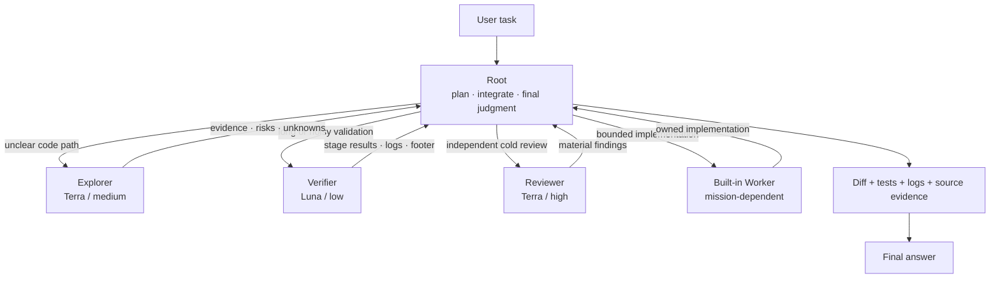
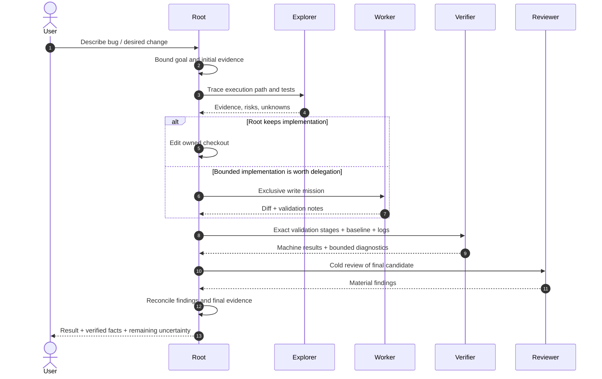
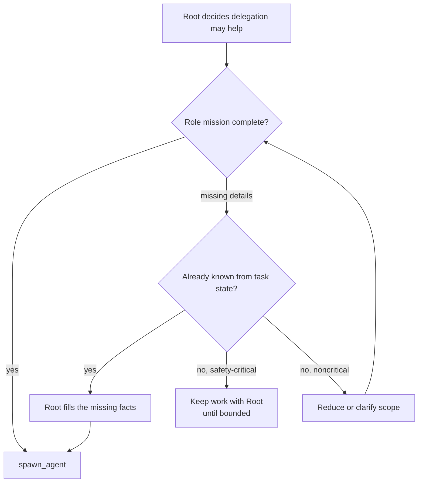
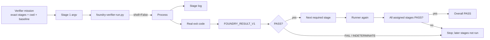
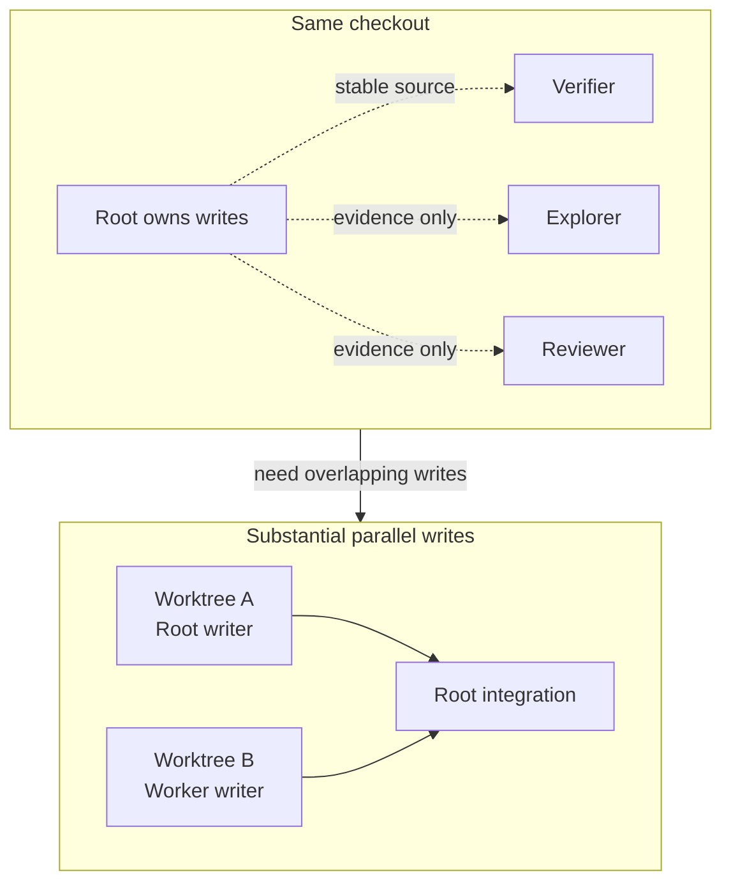
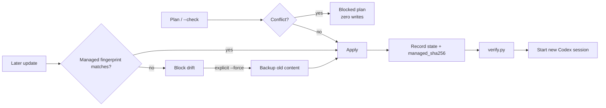

# Codex Agent Foundry

[English](README.md) | [简体中文](README.zh-CN.md)

[](https://github.com/ArseneWg/codex-agent-foundry/actions/workflows/test.yml)

**Codex Agent Foundry is a repository-level collaboration baseline for Codex.** It keeps Root responsible for the task while using a small number of specialists for work that benefits from isolation, parallelism, or bounded execution.

The project is deliberately not a second orchestration framework. It is a compact policy for answering practical questions:

- What should Root keep doing itself?
- When is a subagent worth the handoff cost?
- Which work may run in parallel?
- Who owns writes in a checkout?
- How should long/noisy validation be isolated?
- What evidence is strong enough for Root to declare completion?

The installer, migration logic, state fingerprints, verification helper, tests, and CI exist to distribute and maintain that policy safely.

## How Foundry works



The center of gravity stays with **Root**. Specialists produce bounded evidence or implementation; they do not become competing planners.

### Why only a few persistent roles?

Every permanent role has a real cost: more handoffs, more duplicated context, more routing decisions, more chances for stale assumptions, and a larger configuration surface. Foundry therefore keeps only roles whose isolation is repeatedly useful.

| Role | Default model / effort | Responsibility | Why it is persistent |
| --- | --- | --- | --- |
| **Root** | Current session | User intent, planning, architecture, default implementation, integration, validation ownership, final answer | It already has the most complete task context |
| `explorer` | `gpt-5.6-terra` / `medium` | No-edit code-path, ownership, dependency, and test investigation | Investigation is frequent and benefits from an isolated evidence context |
| `verifier` | `gpt-5.6-luna` / `low` | Long/noisy/repetitive builds, tests, logs, waits, device checks, polling | Execution noise is easy to isolate and does not need Root's full reasoning context |
| `reviewer` | `gpt-5.6-terra` / `high` | Independent no-edit review for correctness, regression, security, state/concurrency, and test gaps | Cold context can challenge assumptions inherited by the writer |
| Built-in `worker` | Mission-dependent | Bounded implementation with explicit write ownership | Codex already has a Worker; Foundry does not duplicate it |

Planning and architecture remain with Root. Narrow research stays on demand. There is no standing Planner or Dispatcher agent.

## A typical task lifecycle

The exact route is workload-dependent, but a substantial bug fix often looks like this:



Not every task needs every role. A small edit may stay entirely with Root. A single short deterministic check should usually stay with Root as well.

## Routing: when to delegate

| Workload | Default route | Reason |
| --- | --- | --- |
| Tiny local edit | Root | Handoff costs more than it saves |
| One short deterministic command | Root | No context/noise benefit from spawning |
| Unclear cross-module behavior | Explorer | Isolated evidence gathering is useful |
| Bounded independent implementation | Worker | Clear write ownership makes delegation safe |
| Long build/test/log stream | Verifier | Keeps execution noise out of Root context |
| Repeated mechanical polling | Verifier | Can aggregate the loop into bounded execution |
| Material implementation ready for challenge | Reviewer | Cold review has independent value |
| Planning / architecture | Root | Avoids responsibility fragmentation |

## Mission Contract: lightweight semantic preflight

Foundry does **not** require JSON missions. Before `spawn_agent`, Root checks whether the selected role has enough task-specific information to work safely.



Required task-specific information is role-dependent because delegation risk is asymmetric:

| Role | Required mission information |
| --- | --- |
| Explorer | Goal, scope, evidence needed, stop condition |
| Reviewer | Review target/baseline, scope, materiality focus, stop condition |
| Worker | Goal, write scope + exclusive ownership, constraints, acceptance criteria, expected validation, stop condition |
| Verifier | Exact stage command(s), cwd, validation baseline, artifact/log policy with log path, stop condition |

Missing details that Root already knows are filled automatically. Unknown ownership, commands, baselines, or acceptance criteria are **not invented** merely to satisfy a checklist.

## Verifier: deterministic stage evidence

The Verifier exists because builds, tests, waits, logs, and device checks can be long and noisy. Its most important rule is that validation status must be a **machine fact**, not a model guess.

Each source-dependent required stage is executed separately through the installed deterministic runner:



The runner uses `subprocess.run(..., shell=False)` and rejects shell `-c` command strings for required stages. That prevents a failed earlier stage from being hidden inside constructs such as:

```bash
bash -c 'configure && make check; echo done'
```

Instead, required stages are explicit and individually evidenced:

```bash
python3 .codex/foundry-verifier-run.py --log /tmp/configure.log -- ./configure ...
python3 .codex/foundry-verifier-run.py --log /tmp/make-check.log -- make -j2 check
```

A stage PASS requires both:

```text
process exit code = 0
FOUNDRY_RESULT_V1 exit_code=0 status=PASS
```

A nonzero exit is FAIL. Missing, malformed, stale, or conflicting machine evidence is INDETERMINATE. **Overall PASS requires every assigned stage to have run and passed.** Root reads the referenced stage logs before accepting delegated PASS evidence.

### What the Verifier does not do

- It does not broadly diagnose a failing build.
- It does not edit source or project configuration to make tests pass.
- It does not silently change models if Luna cannot start.
- It does not turn skipped stages into PASS.

Failures return to Root, which decides whether to investigate, fix, rerun, or escalate.

## Write ownership and worktrees

Read concurrency is cheap; write concurrency is expensive. Foundry therefore keeps **one source-code writer per checkout**.



While Worker owns a checkout, Root does not edit that checkout concurrently. For substantial parallel implementation, use separate worktrees.

Source-dependent validation has a similar ownership rule: if Verifier runs in the same checkout, relevant source must stay stable. If Root must continue editing, validation moves to a separate worktree or immutable snapshot. Evidence from a changed baseline is discarded.

## Context economy: what should be concise?

Foundry optimizes **runtime context**, not human documentation.

| File / surface | When it reaches model context | Documentation policy |
| --- | --- | --- |
| `runtime/AGENTS.fragment.md` | Installed into project instructions | Keep concise; every repeated rule costs runtime context |
| `.codex/agents/*.toml` instructions | When that specialist starts | Keep role contract narrow and explicit |
| Skill `description` | During Skill discovery/routing | Keep very small and scoped |
| `SKILL.md` | When maintenance Skill is invoked | Moderate; operational steps only |
| `README.md` / `README.zh-CN.md` | Human reads it on GitHub | Optimize for understanding, not prompt byte count |
| `references/design.md` | Loaded only for design/lifecycle work | Keep detailed rationale on demand |
| `evals/README.md` | Loaded for evaluation work | Keep evaluator guidance explicit |

This separation is intentional: README can explain the system richly without bloating every Codex task.

## Install, update, and remove

The installer requires **Python 3.11+**. If the system `python3` is older, use an explicit 3.11+ interpreter.

From a Foundry checkout:

```bash
SKILL=.agents/skills/install-codex-agent-foundry

# Preview every planned mutation first
python3 "$SKILL/scripts/install.py" /path/to/repo --check

# Apply
python3 "$SKILL/scripts/install.py" /path/to/repo

# Verify installed state
python3 "$SKILL/scripts/verify.py" /path/to/repo
```

After installation, start a **new Codex session** in the target repository so project instructions and agent profiles load from a fresh session.

The target receives:

| Path | Purpose |
| --- | --- |
| `AGENTS.md` managed block | Runtime collaboration policy |
| `.codex/config.toml` | Project concurrency setting |
| `.codex/agents/explorer.toml` | Explorer role override |
| `.codex/agents/reviewer.toml` | Reviewer profile |
| `.codex/agents/verifier.toml` | Verifier profile |
| `.codex/foundry-verifier-run.py` | Deterministic one-stage verification runner |
| `.codex/.agent-foundry.json` | Ownership, model selections, provenance, fingerprints |

### Safe maintenance lifecycle



The installer is deliberately conservative:

- foreign same-name profiles block unless explicit `--force` authorizes backup + replacement;
- current v3 state stores `managed_sha256` fingerprints for the three profiles and Verifier runner;
- manual drift blocks update and uninstall instead of being silently overwritten or deleted;
- older v3 state without fingerprints adopts content only when it already matches the new desired template;
- v1/v2 migration uses frozen historical templates whose SHA-256 values are pinned by CI;
- blocked plans perform zero writes;
- apply checks preconditions and rolls back files already changed if a later write fails.

### TOML preservation

Foundry changes only the concurrency key it owns. Before accepting an add/remove operation, the installer parses the TOML before and after and checks that the semantic document differs only at:

```text
agents.max_concurrent_threads_per_session
```

Table-like text inside multiline strings is not treated as real configuration. Ambiguous edits are rejected rather than guessed.

## Model routing and overrides

Defaults:

| Role | Model | Reasoning effort |
| --- | --- | --- |
| Explorer | `gpt-5.6-terra` | `medium` |
| Reviewer | `gpt-5.6-terra` | `high` |
| Verifier | `gpt-5.6-luna` | `low` |

Persistent roles are selected by `agent_type`; their profiles own model and effort. Do not pass redundant spawn-time model/effort overrides merely to restate the profile.

Installer model overrides are role-local:

```bash
python3 "$SKILL/scripts/install.py" /path/to/repo \
  --explorer-model <model> \
  --reviewer-model <model> \
  --verifier-model <model>
```

Selections are persisted in Foundry state. The historical Reviewer default `gpt-5.6` migrates to the current Terra default when no explicit Reviewer override is supplied. Other explicit model selections are preserved.

If the configured Luna Verifier role cannot start on a particular client/account, Root performs validation for that session or the installation is explicitly changed to `--verifier-model gpt-5.6-terra`. Foundry does not silently switch models.

## Verification boundaries

`verify.py` validates managed paths, state schema, runtime fingerprints, TOML, expected profiles/runner, and drift. `--runtime-check` additionally checks Codex CLI/version and reports configured role models.

It does **not** prove:

- account-level model entitlement;
- that a new session loaded the project configuration;
- the actual resolved model/effort of every child thread;
- that a subagent obeyed its mission;
- that the target repository's build/tests passed.

Those behavioral guarantees require forward evaluation. See [evals/README.md](evals/README.md).

## Repository map

| Path | What lives there |
| --- | --- |
| `runtime/` | Canonical installed policy, role profiles, Verifier runner |
| `.agents/skills/install-codex-agent-foundry/` | Installer Skill, scripts, frozen migration fixtures, generated runtime package |
| `evals/` | Directional routing/ownership scenarios and forward-eval guidance |
| `scripts/package_runtime.py` | Copies canonical runtime into the distributable Skill package |
| `tests/` | Installer, lifecycle, runtime, prompt-surface, and regression tests |
| `.github/workflows/test.yml` | CI across supported Python versions |
| `AGENTS.md` | Guidance for developing Foundry itself |
| `README.md` / `README.zh-CN.md` | Human-facing product documentation |

`runtime/` is the source of truth. Generated `assets/project/` files should never be edited independently.

## Development and validation

```bash
python3 scripts/package_runtime.py
python3 scripts/package_runtime.py --check
python3 -m unittest discover -s tests -v
python3 -m compileall -q .agents/skills/install-codex-agent-foundry/scripts scripts tests
```

CI covers Python 3.11, 3.12, and 3.13, plus a Python 3.10 guard that checks the maintenance scripts fail with a clear compatibility message instead of a traceback.

Static CI is necessary, but live-model behavior still requires forward evals—especially routing, mission completion, write ownership, minimal-history delivery, and Verifier evidence integrity.

## Design principles

1. **Root remains accountable.** Subagents provide evidence or bounded work; they do not dilute final responsibility.
2. **Delegate for isolation or latency, not novelty.** A cheap model alone is not a reason to spawn.
3. **Read concurrency is cheap; write concurrency is expensive.** Keep one writer per checkout.
4. **Machine facts beat agent claims.** Validation status comes from process evidence and stage logs.
5. **Keep runtime prompts small.** Put deterministic behavior in code and long rationale in on-demand docs.
6. **Keep human docs useful.** README should explain the product clearly even when runtime instructions are compact.
7. **Prefer Codex primitives.** Reuse built-in Worker and native role vocabulary instead of inventing a software-company org chart.

For deeper rationale and lifecycle trade-offs, see [the design reference](.agents/skills/install-codex-agent-foundry/references/design.md).

Official Codex references: [Subagents](https://developers.openai.com/codex/subagents) · [AGENTS.md](https://developers.openai.com/codex/guides/agents-md) · [Skills](https://developers.openai.com/codex/skills) · [Review commands](https://developers.openai.com/codex/cli/slash-commands)
