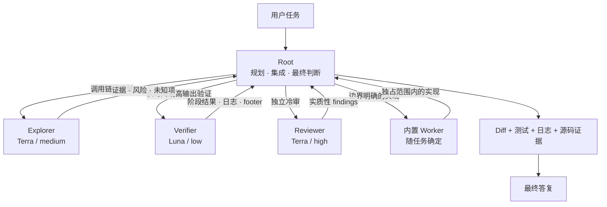
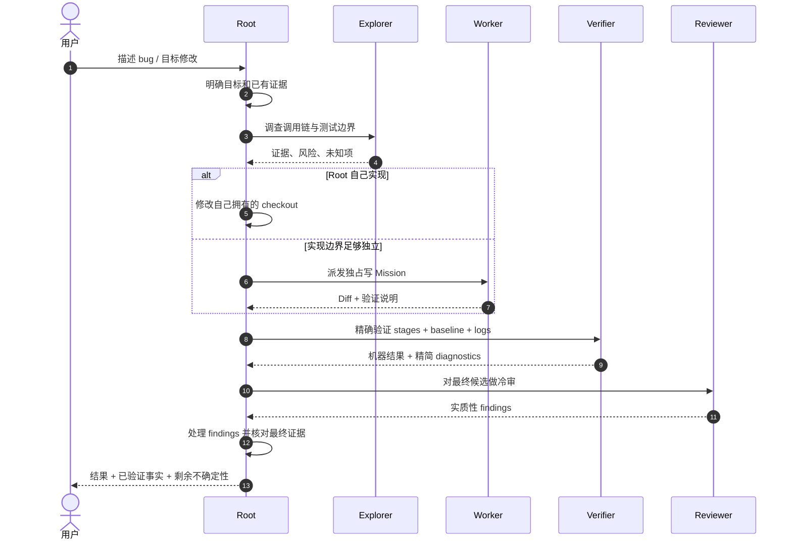
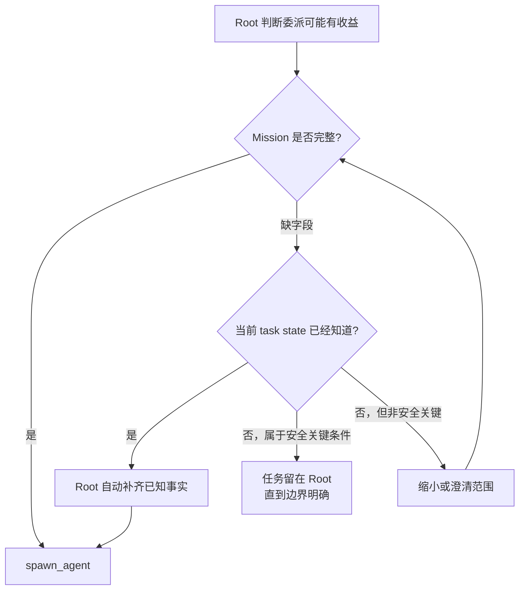
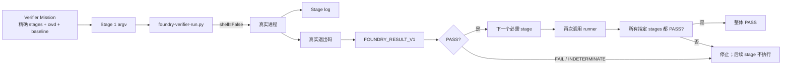
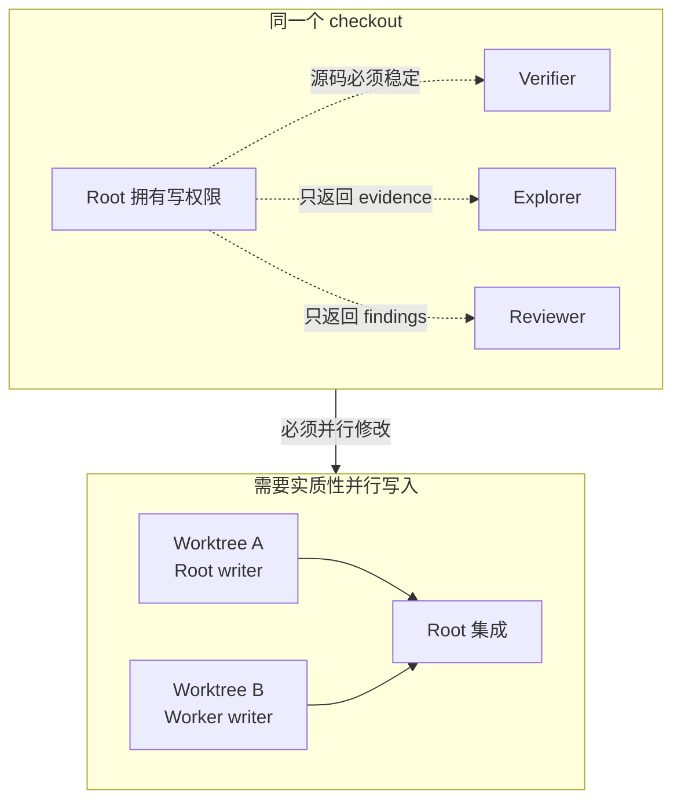
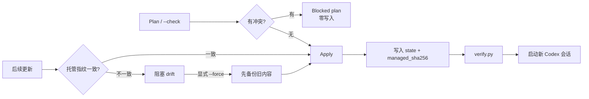

# Codex Agent Foundry

[English](README.md) | [简体中文](README.zh-CN.md)

[](https://github.com/ArseneWg/codex-agent-foundry/actions/workflows/test.yml)

**Codex Agent Foundry 是一套面向 Codex 的仓库级协作基线。** Root 保留任务的主导权和最终责任，只把真正适合隔离、并行或低噪声执行的工作交给少量专门角色。

它不是另一套复杂编排框架，也不是把“软件团队组织架构”搬进 Agent。它解决的是几个很实际的问题：

- 哪些工作应该继续由 Root 自己完成？
- 什么情况下值得付出一次 subagent 交接成本？
- 哪些工作可以安全并行？
- 一个 checkout 里谁拥有写权限？
- 长时间、高输出的构建/测试怎样不污染 Root 上下文？
- Root 在什么证据下才能真正宣布任务完成？

Installer、迁移逻辑、state 指纹、Verifier runner、测试和 CI，都是为了安全地分发和维护这套协作规则。

## Foundry 怎样工作



系统的重心始终是 **Root**。子 Agent 提供范围明确的证据或实现，不成为新的 Planner、架构决策者或最终责任人。

### 为什么只保留少量长期角色？

每增加一个常驻角色，都要付出成本：上下文交接、重复信息、更多路由判断、更多 stale assumption，以及更大的配置和维护面。因此 Foundry 只保留那些“隔离后长期有稳定收益”的角色。

| 角色 | 默认模型 / 推理强度 | 职责 | 为什么长期保留 |
| --- | --- | --- | --- |
| **Root** | 当前会话 | 用户意图、规划、架构、默认实现、集成、验证责任、最终答复 | 它拥有最完整的任务上下文 |
| `explorer` | `gpt-5.6-terra` / `medium` | 不改文件，追踪调用链、ownership、依赖、测试，区分事实和假设 | 调查类工作高频，独立 evidence context 很有价值 |
| `verifier` | `gpt-5.6-luna` / `low` | 长时间/高输出/重复的构建、测试、日志、等待、设备检查、轮询 | 执行噪声容易隔离，不需要 Root 的完整推理上下文 |
| `reviewer` | `gpt-5.6-terra` / `high` | 独立冷审正确性、回归、安全、状态/并发和测试缺口 | 冷上下文可以挑战 writer 已经形成的假设 |
| 内置 `worker` | 随任务确定 | 在明确的独占写范围里完成实现 | Codex 已经有 Worker，没有必要复制一个 Implementer |

规划和架构留在 Root；研究按需派发；不增加常驻 Planner 或 Dispatcher。

## 一次典型任务怎样流转

不同任务不一定会使用全部角色。一个相对完整的 bug 修复通常会经历下面的过程：



小修改可以完全不派 Agent。一个短且确定的命令通常也应该直接由 Root 执行。

## 什么情况下派发 Agent

| 工作负载 | 默认路由 | 原因 |
| --- | --- | --- |
| 很小的本地修改 | Root | 交接成本大于收益 |
| 一个短且确定的命令 | Root | 没有明显上下文/噪声隔离价值 |
| 跨模块行为不清楚 | Explorer | 适合独立收集证据 |
| 范围明确、可独占的实现 | Worker | ownership 清楚后写入委派才安全 |
| 长构建 / 长测试 / 大日志 | Verifier | 避免把噪声灌进 Root 上下文 |
| 重复机械轮询 | Verifier | 可用一个 bounded execution 聚合 |
| 实质性实现完成，需要挑战假设 | Reviewer | 冷审有独立增量价值 |
| 规划 / 架构 | Root | 避免责任链碎片化 |

## Mission Contract：轻量语义检查，不是 JSON 模板

Foundry **不要求固定 JSON Mission**。Root 在 `spawn_agent` 前做一次角色相关的语义检查：这个任务是否已经 bounded 到足够安全？



不同角色的风险不同，因此必需信息也不同：

| 角色 | 必需的任务级信息 |
| --- | --- |
| Explorer | goal、scope、需要的 evidence、stop condition |
| Reviewer | review target/baseline、scope、materiality focus、stop condition |
| Worker | goal、write scope + exclusive ownership、constraints、acceptance、validation、stop condition |
| Verifier | 精确 stage 命令、cwd、validation baseline、artifact/log policy + log path、stop condition |

如果信息已经在当前任务上下文中，Root 自动补齐；如果 ownership、command、baseline 或 acceptance 根本不知道，就不能为了“字段齐全”而猜一个值。

## Verifier：把验证结论变成机器证据

Verifier 的存在，是因为构建、测试、等待、日志、设备检查往往耗时而且输出巨大。最重要的原则是：**PASS/FAIL 必须来自机器事实，而不是模型从日志文字里猜。**

源码相关验证按阶段执行，每个必需阶段都通过安装到项目里的确定性 runner 单独运行：



runner 使用 `subprocess.run(..., shell=False)`，并拒绝把必需验证阶段塞进 shell `-c` 字符串。这样就不会再出现这种“前面失败、后面成功命令把状态掩盖”的写法：

```bash
bash -c 'configure && make check; echo done'
```

正确做法是把必需阶段显式拆开：

```bash
python3 .codex/foundry-verifier-run.py --log /tmp/configure.log -- ./configure ...
python3 .codex/foundry-verifier-run.py --log /tmp/make-check.log -- make -j2 check
```

单个 stage 要判定 PASS，必须同时满足：

```text
process exit code = 0
FOUNDRY_RESULT_V1 exit_code=0 status=PASS
```

非零退出码是 FAIL。footer 缺失、格式错误、过期或与工具结果冲突时是 INDETERMINATE。**整体 PASS 要求所有指定 stage 都真实执行并 PASS。** Root 在接受 delegated PASS 前，要读取对应 stage 日志并核对 footer。

### Verifier 不负责什么

- 不把构建失败扩展成全面 diagnosis；
- 不修改源码或项目配置来“修到测试通过”；
- Luna 无法启动时不静默切模型；
- 未执行的 stage 永远不能当成 PASS。

失败证据回到 Root，由 Root 决定调查、修改、重跑还是升级处理。

## 写入 ownership 与 worktree

Foundry 的核心经验之一是：**读并发很便宜，写并发很昂贵。** 因此同一个 checkout 同时只允许一个源码 writer。



Worker 独占一个 checkout 时，Root 不同时修改那个 checkout。真正需要并行实现时使用不同 worktree。

源码相关验证也遵循类似规则：Verifier 在同一个 checkout 跑验证时，相关源码必须保持稳定；如果 Root 还要继续改，就把验证放到独立 worktree 或 immutable snapshot。源码 baseline 变化后，旧验证证据作废。

## Token / Context 到底该省在哪里？

Foundry 优化的是**运行时上下文**，不是面向人的项目文档。

| 文件 / 表面 | 什么时候进入模型上下文 | 文档策略 |
| --- | --- | --- |
| `runtime/AGENTS.fragment.md` | 安装后成为项目指令 | 要简洁；重复规则会持续消耗 runtime context |
| `.codex/agents/*.toml` instructions | 对应 specialist 启动时 | 只保留该角色真正需要的契约 |
| Skill `description` | Skill discovery / routing 时 | 必须非常小且范围明确 |
| `SKILL.md` | 维护 Skill 被调用时 | 适中，只放操作流程 |
| `README.md` / `README.zh-CN.md` | 人在 GitHub 上阅读 | 以易懂为目标，不按 prompt byte 限制 |
| `references/design.md` | 只有设计/生命周期工作才按需读取 | 可以保留完整设计理由 |
| `evals/README.md` | 做评估工作时才加载 | 保留清晰 evaluator guidance |

因此 README 可以完整解释系统，而不会自动把每次 Codex 任务的 prompt 撑大。

## 安装、更新与卸载

维护脚本要求 **Python 3.11+**。系统 `python3` 较旧时，请显式选择已有的 3.11+ 解释器。

在 Foundry checkout 中：

```bash
SKILL=.agents/skills/install-codex-agent-foundry

# 先预览所有计划改动
python3 "$SKILL/scripts/install.py" /path/to/repo --check

# 应用
python3 "$SKILL/scripts/install.py" /path/to/repo

# 检查安装状态
python3 "$SKILL/scripts/verify.py" /path/to/repo
```

安装完成后，在目标仓库启动一个**新的 Codex 会话**，让项目级指令和角色配置从新会话加载。

目标仓库会得到：

| 路径 | 作用 |
| --- | --- |
| `AGENTS.md` managed block | 运行时协作规范 |
| `.codex/config.toml` | 项目并发配置 |
| `.codex/agents/explorer.toml` | Explorer role override |
| `.codex/agents/reviewer.toml` | Reviewer profile |
| `.codex/agents/verifier.toml` | Verifier profile |
| `.codex/foundry-verifier-run.py` | 确定性单阶段验证 runner |
| `.codex/.agent-foundry.json` | ownership、模型选择、provenance、指纹 |

### 安全维护流程



Installer 故意采取保守策略：

- 外部同名 profile 默认阻塞，只有显式 `--force` 才允许备份后替换；
- 当前 v3 state 会保存三个 profile 和 Verifier runner 的 `managed_sha256`；
- 手工 drift 会阻塞更新和卸载，不会静默覆盖或删除；
- 指纹机制引入前的旧 v3，只有内容已经等于新模板时才会自动纳入新基线；
- v1/v2 迁移使用冻结历史模板，SHA-256 由 CI 固定；
- blocked plan 必须零写入；
- Apply 每一步都会检查 precondition，后续写入失败时会回滚已经修改的文件。

### TOML 配置保护

Foundry 只修改自己拥有的并发项。对 `.codex/config.toml` 做 add/remove 后，会重新解析前后文档，要求语义差异只能出现在：

```text
agents.max_concurrent_threads_per_session
```

多行字符串中的 `[agents]` 等文本不会被当成真实 TOML table；无法安全证明修改范围时直接拒绝，而不是猜。

## 模型路由与覆盖

默认值：

| 角色 | 模型 | 推理强度 |
| --- | --- | --- |
| Explorer | `gpt-5.6-terra` | `medium` |
| Reviewer | `gpt-5.6-terra` | `high` |
| Verifier | `gpt-5.6-luna` | `low` |

长期角色通过 `agent_type` 选择，模型和推理强度由 profile 自己拥有。不要为了“重申 profile”再次传 spawn-time model/effort。

Installer 的模型覆盖只影响指定角色：

```bash
python3 "$SKILL/scripts/install.py" /path/to/repo \
  --explorer-model <model> \
  --reviewer-model <model> \
  --verifier-model <model>
```

模型选择会保存到 Foundry state。历史 Reviewer 默认 `gpt-5.6` 在没有显式 Reviewer override 时迁移到当前 Terra 默认值；其他显式模型选择保留。

如果某个客户端/账户无法启动配置好的 Luna Verifier，本次验证由 Root 执行，或者显式安装为 `--verifier-model gpt-5.6-terra`。Foundry 不静默切模型。

## 验证边界

`verify.py` 会检查托管路径、state schema、runtime fingerprint、TOML、profile、runner 和 drift。`--runtime-check` 还会检查 Codex CLI/version，并报告配置的角色模型。

它**不能证明**：

- 账户是否有对应模型权限；
- 新会话是否已经正确加载项目配置；
- child thread 最终实际使用了哪个模型/effort；
- 子 Agent 是否真的遵守 Mission；
- 目标仓库构建/测试是否成功。

这些行为保证仍需要真实 forward eval。见 [evals/README.md](evals/README.md)。

## 仓库结构

| 路径 | 内容 |
| --- | --- |
| `runtime/` | canonical 运行规则、角色 profiles、Verifier runner |
| `.agents/skills/install-codex-agent-foundry/` | Installer Skill、脚本、冻结迁移 fixtures、生成的 runtime package |
| `evals/` | 路由/ownership 场景和 forward-eval 方法 |
| `scripts/package_runtime.py` | 把 canonical runtime 打包进可分发 Skill |
| `tests/` | Installer、生命周期、runtime、prompt surface、回归测试 |
| `.github/workflows/test.yml` | 多 Python 版本 CI |
| `AGENTS.md` | 开发 Foundry 本身时使用的规则 |
| `README.md` / `README.zh-CN.md` | 面向人的产品文档 |

`runtime/` 是唯一源。生成出来的 `assets/project/` 不应独立手改。

## 开发与验证

```bash
python3 scripts/package_runtime.py
python3 scripts/package_runtime.py --check
python3 -m unittest discover -s tests -v
python3 -m compileall -q .agents/skills/install-codex-agent-foundry/scripts scripts tests
```

CI 覆盖 Python 3.11、3.12、3.13，并有一个 Python 3.10 guard，用来保证旧解释器得到清晰兼容性错误而不是 traceback。

静态 CI 是必要条件，但真实 Agent 行为仍需要 forward eval，尤其是路由、Mission 完整性、write ownership、minimal-history delivery 和 Verifier evidence integrity。

## 设计原则

1. **Root 最终负责。** 子 Agent 提供证据或 bounded work，不稀释最终责任。
2. **为了隔离和延迟收益而委派，不是为了“多一个 Agent”。** 模型便宜本身不是 spawn 理由。
3. **读并发便宜，写并发昂贵。** 一个 checkout 同时只有一个 writer。
4. **机器事实优先于 Agent 结论。** 验证结果来自进程退出码和 stage logs。
5. **运行时 prompt 要小。** 能写成确定性代码的行为就不要长期占 prompt。
6. **人类文档要好懂。** README 可以完整解释项目，不应该为了 runtime token 牺牲可读性。
7. **优先复用 Codex 原生能力。** 复用内置 Worker 和已有角色词汇，而不是造一套“虚拟软件公司”。

更多设计理由和生命周期 trade-off 见 [Design Reference](.agents/skills/install-codex-agent-foundry/references/design.md)。

Codex 官方参考：[Subagents](https://developers.openai.com/codex/subagents) · [AGENTS.md](https://developers.openai.com/codex/guides/agents-md) · [Skills](https://developers.openai.com/codex/skills) · [Review](https://developers.openai.com/codex/cli/slash-commands)
